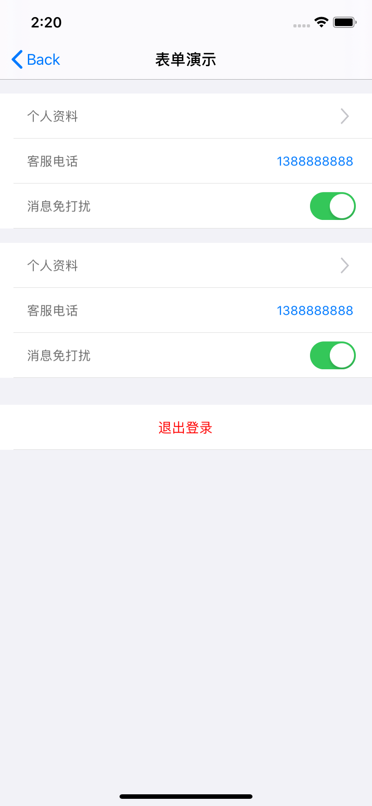

# EHFormKit
静态列表构造工具 = = 白猫出品

## you say a xx without a picture



# 代码示例

```objective-c
self.tableView = [EHFormTableView tableView];
self.tableView.frame = self.view.bounds;
self.tableView.backgroundColor = [UIColor whiteColor];
[self.view addSubview:self.tableView];
// 开启自动滚动到输入框
self.tableView.autoScrollToTextField = YES;

__weak typeof(self) weakSelf = self;

NSInteger rowHeight = 50;

UIColor *spaceColor = [UIColor lightGrayColor];

[self.tableView addWhiteRowWithCellClass:[EHWhiteRowTableViewCell class] BackgroundColor:spaceColor rowHeight:16 separatorHeight:0 separatorColor:nil separatorOffset:0];

[self.tableView addNormalRowWithName:@"个人资料" value:nil cellClass:[EHTapTableViewCell class] rowHeight:rowHeight callBack:^(EHFormModel *model, EHFormModelEventType eventType, NSDictionary *dictionary) {
    [weakSelf logWithModel:model];
}];

[self.tableView addNormalRowWithName:@"客服电话" value:nil cellClass:[EHPhoneNumberTableViewCell class] rowHeight:rowHeight callBack:^(EHFormModel *model, EHFormModelEventType eventType, NSDictionary *dictionary) {
    [weakSelf logWithModel:model];
}];

[[self.tableView addUnableTapRowWithName:@"消息免打扰" value:nil cellClass:[EHSwitchTableViewCell class] rowHeight:rowHeight callBack:^(EHFormModel *model, EHFormModelEventType eventType, NSDictionary *dictionary) {
    if (eventType == EHFormModelEventSwitch) {
        if (model.on) {
            NSLog(@"开关on");
        } else {
            NSLog(@"开关off");
        }
    }
}] eh_attributed:^(EHFormModel *attributed) {
    /**
     * 注意attributed为model补充属性, 你可以在里面设置一些默认值或者给model赋一些必要的值, 这些都能在初始化cell的时候获取到
     */
    // 例如: 设置开关默认值
    attributed.on = YES;
}];


[self.tableView addWhiteRowWithCellClass:[EHWhiteRowTableViewCell class] BackgroundColor:spaceColor rowHeight:16 separatorHeight:0 separatorColor:nil separatorOffset:0];

[self.tableView addUnableTapRowWithName:@"请输入用户名" value:nil cellClass:[EHTextFieldTableViewCell class] rowHeight:rowHeight callBack:^(EHFormModel *model, EHFormModelEventType eventType, NSDictionary *dictionary) {
    if (eventType == EHFormModelEventTextFieldShouldChanged) {
        NSLog(@"输入框文字:%@", dictionary[@"value"]);
    }
}];

[self.tableView addWhiteRowWithCellClass:[EHWhiteRowTableViewCell class] BackgroundColor:spaceColor rowHeight:16 separatorHeight:0 separatorColor:nil separatorOffset:0];

[self.tableView addNormalRowWithName:@"退出登录" value:nil cellClass:[EHButtonTableViewCell class] rowHeight:rowHeight callBack:^(EHFormModel *model, EHFormModelEventType eventType, NSDictionary *dictionary) {
    if (eventType == EHFormModelEventTypeButtonTouchUpInside) {
        UIAlertController *alert = [UIAlertController alertControllerWithTitle:@"提示" message:@"是否退出登录" preferredStyle:UIAlertControllerStyleAlert];
        UIAlertAction *determin = [UIAlertAction actionWithTitle:@"确定" style:UIAlertActionStyleDefault handler:^(UIAlertAction * _Nonnull action) {
            [weakSelf.navigationController popViewControllerAnimated:YES];
        }];
        UIAlertAction *cancel = [UIAlertAction actionWithTitle:@"取消" style:UIAlertActionStyleCancel handler:^(UIAlertAction * _Nonnull action) {
        }];
        [alert addAction:determin];
        [alert addAction:cancel];
        [[UIApplication sharedApplication].keyWindow.rootViewController presentViewController:alert animated:YES completion:nil];
    }
}];
```

# 导入

```
pod 'EHFormKit', git=>'https://github.com/objcat/EHFormKit.git'
```

# 更新日志

 #### 2018.9.13
 1.基础表单工具  
 #### 2019.11.14
 1.新增无痛全贴合自定义cell  
 2.支持自动滚动到输入行  
 3.支持无痛作用域内设置属性  

#### 2021.1.17

1.回调新增事件类型
